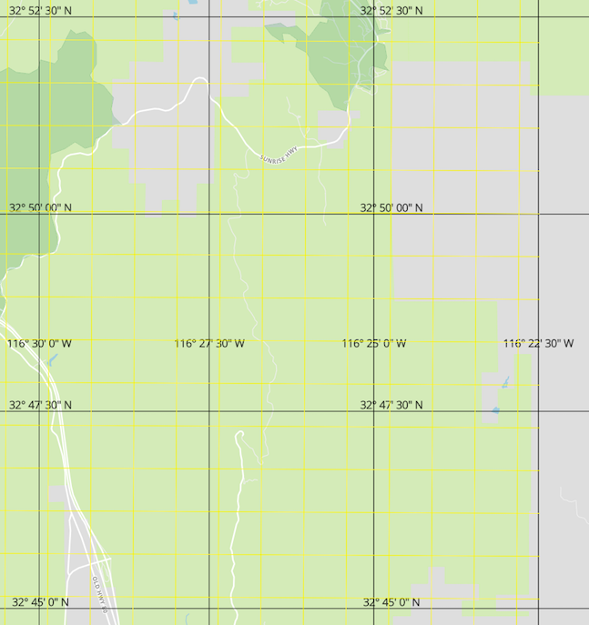
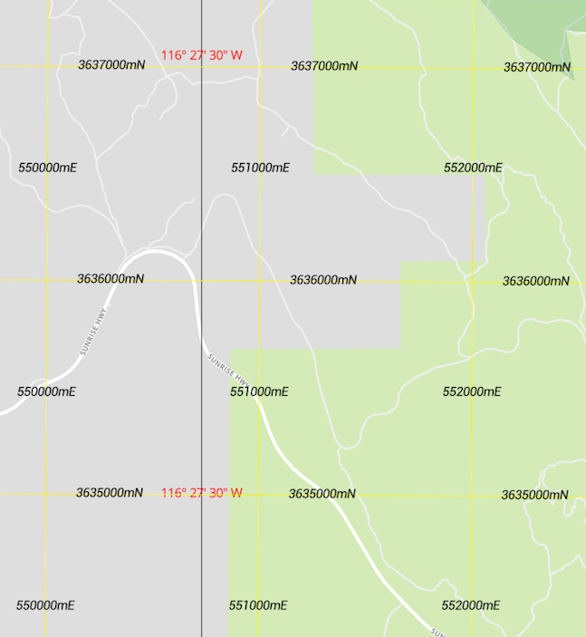

# Make Latitude & Longitude Lines

NPM script to generate latitude and longitude lines in GeoJSON format

Usage

``` bash
# do this once
npm -g install

makeLatitudeLongitudeLines

```

Generates GeoJSON that looks like this


``` javascript
// This example draws lines every 2.5 minutes
{
  "type": "Feature",
  "properties": {
    "wgs84Degrees": "32° 50' 00\" N",
    "wgs84Decimal": "32.833333"
  },
  "geometry": {"type":"LineString","coordinates":[[-180,32.833333],[180,32.833333]]      }
},
{
  "type": "Feature",
  "properties": {
    "wgs84Degrees": "32° 52' 30\" N",
    "wgs84Decimal": "32.875000"
  },
  "geometry": {"type":"LineString","coordinates":[[-180,32.875],[180,32.875]]      }
}
```

* Black Latitude & Longitude lines every 2.5 minutes



---

* Yellow UTM lines, every 1 Km
  * Universal Transverse Mercator lines sourced from [NGA Office of Geomatics](http://earth-info.nga.mil/GandG/update/index.php?dir=coordsys&action=utm-1km-polyline-dloads)




### Resources

* [Degrees Minutes Seconds to/from Decimal Degrees](https://www.fcc.gov/media/radio/dms-decimal)
