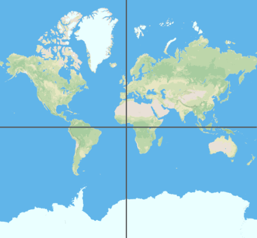

## Make Latitude & Longitude Lines

NPM script to generate latitude and longitude lines in GeoJSON format

Usage

``` bash
# do this once
npm install --global
# npm uninstall --global

makeLatitudeLongitudeLines

# or if you want to install to the current folder
npm install
./cli.js

#

```

Generates GeoJSON that looks like this


``` javascript
// This example draws lines every 2.5 minutes
{
  "type": "Feature",
  "properties": {
    "wgs84Degrees": "32° 50' 00\" N",
    "wgs84Decimal": "32.833333"
  },
  "geometry": {"type":"LineString","coordinates":[[-180,32.833333],[180,32.833333]]      }
},
{
  "type": "Feature",
  "properties": {
    "wgs84Degrees": "32° 52' 30\" N",
    "wgs84Decimal": "32.875000"
  },
  "geometry": {"type":"LineString","coordinates":[[-180,32.875],[180,32.875]]      }
}
```

``` bash
makeLatitudeLongitudeLines > 2.5minutes.geojson

# convert to ESRI Shapefile
ogr2ogr -f "ESRI Shapefile" 2.5minutes.shp 2.5minutes.geojson

# clip to San Diego
BBOX="-117.34573 32.52852 -116.57119 33.05149"
ogr2ogr \
  -t_srs EPSG:4326 \
  -clipdst $BBOX \
  -f GeoJSON sandiego.geojson 2.5minutes.geojson
```
### Examples

* Black Latitude & Longitude lines every 2.5 minutes


---

* Yellow UTM lines, every 1 Km
  * Universal Transverse Mercator lines sourced from [NGA Office of Geomatics](http://earth-info.nga.mil/GandG/update/index.php?dir=coordsys&action=utm-1km-polyline-dloads)


-----

Filter the GeoJSON and just use the lines that cross at Null Island.

``` bash
# use `makeLatitudeLongitudeLines` instead of `cli.js` if you installed as global

# Generate
./cli.js > out.geojson

# Convert to ndjson
cat out.geojson | geojson2ndjson > out.ndjson

# filter and keep certain  properties
ndjson-filter < out.ndjson 'd.properties.wgs84Decimal == "0.000000"' > null-island-grid.ndjson

# merge a stream into a feature collection
ndjson-reduce < null-island-grid.ndjson 'p.features.push(d), p' '{type: "FeatureCollection", features: []}' > null-island-grid.geojson

# view at geojson.io
geojsonio null-island-grid.geojson


# or, as a one-liner

cat out.geojson | \
  geojson2ndjson | \
  ndjson-filter 'd.properties.wgs84Decimal == "0.000000"' | \
  ndjson-reduce 'p.features.push(d), p' '{type: "FeatureCollection", features: []}'
```



-----

### References

* Degrees Minutes Seconds to/from Decimal Degrees _ https://www.fcc.gov/media/radio/dms-decimal

* https://en.wikipedia.org/wiki/Decimal_degrees

* https://github.com/stevage/geojson2ndjson

* https://github.com/mbostock/ndjson-cli#filter

* https://github.com/mapbox/geojsonio-cli
